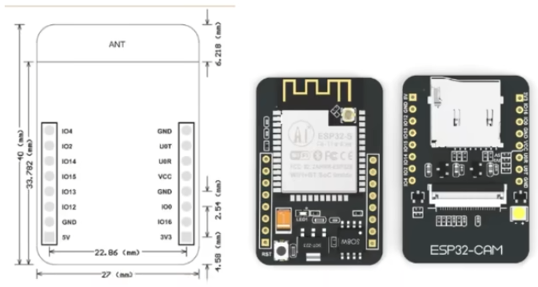
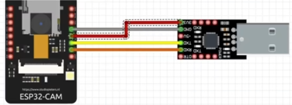

# Vision_Sensor_Prim
Vision input forward module for later modules in Intelegents projects.  
 
这个工程实现了一个：集成在嵌入式控制模块（Haas）上的嵌入式硬件（ESP32）用于采集环境自然图像的工具，这个工具可以作为远程(目前内网，没做内网穿透)捕捉画面等作用，是只能模块的前端信号输入。 
硬件：ESP32开发板， OV2640摄像头，USB OT TTL 驱动。 
将ESP32的“输出”和“输入” 分别与 TTL 的RXD(输入)和TXD(输出)相接。然后将两者的GND 和 3v3(烧代码时)相接。 

 
通过ESP32的资料，我们了解应当在烧写代码的时候将 GPIO0 设为低电频，因此将 GPIO0 直接与 板子上的 GND 短接，在烧写完代码之后再将其做好。 

烧到板子上的软件：[./CameraCase/](./CameraCase/)  
基本是参考Camera Stream 流式传输的简单模块的案例。然而由于我们只注重将视频流发送到特定的ip供取用，对依赖http的在内网中访问的视频流显示部分（[./CameraCase/app_httpd.cpp](./app_httpd.cpp)）进行了改动，但是最后呈现的主要功能未改变。 

内网访问到的，直接看的视频截图： 
 